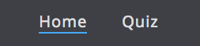
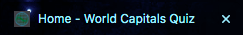

# World Capitals Quiz 

World Capitals Quiz is a JavaScript multiple choice geography quiz game. It allows users to select a difficulty mode depending on their world capital knowledge and it will give the user feedback on their end result. 

## Features

### Site Wide

* Navigation Menu: 
    * The navigation menu contains links to Home and Quiz pages and it is responsive on all devices. 
    * This will allow the user to easily navigate between these pages on a device of any size. 

* Footer: 
    * The footer will contain the social media links to Instagram, Facebook and Twitter. 
    * This will allow the user to follow us and the above platforms to see when we release more quizzes for them to attempt. 

* Favicon: 
    * A favicon is added to every page, this favicon image is the same as our logo.  
    * By using a favicon, it will allow the user to easily identify the website in case they have multiple tabs opened. 

* 404 Page: 
    * A 404 error page is implemented, just in case the user happens to navigate to a broken link. 
    * If the user lands on this page, they will easily be navigated back to the hame page by their clicking on the link given, or by clicking the header. There will be no need to use the back button on the browser. 

### Home Page

* Rules and Instructions Modal

    * The home page will have a button that user will be encouraged to click on for the rules and instructions in relation to the quiz. When this button is clicked, a modal will be displayed. 

    * This was implemented so that the user can have a clear understanding of how to play the game. 

* Game Start Button 

    * A button labelled ‘Get Started!’ will direct the user to select a difficulty mode.

    * This will allow the user to select their desired difficulty mode and start the game. 

## Technologies 

* HTML
    * HTML was used as the main language to develop the structure of the website.

* CSS
    * Custom CSS was used to style the website and it exists in an external file.

* JavaScript 
    * JavaScript was used for the multiple choice quiz gameplay and it exists in an external file. 

* GitHub
    * GitHub IDE was used the develop the website.
    * GitHub is used to host the source code and it is deployed using Git Pages.

* Git 
    * Git is used to commit and push code during the development of the website.

* Font Awesome 
    * Icons used in this website can be found on the [Font Awesome Website](https://fontawesome.com/). Icons used were for the social media links, which can be found on the footer of the website. 

* Favicon 
    * The favicon used was created on the [favicon.io Website](https://favicon.io/).

* Canva
    * Canva was used to create the logo in the header, also, that same image was used to create the favicon. 

## Functional Testing

### Navigation Links

Testing was conducted on the navigation links on all pages to ensure that the corresponding page opens. This was accomplished by clicking on each of the navigation links on each page. Navigation Link (Page Opened):

* Home (index.html)
* Quiz (game.html)

Links on all pages navigated to the correct pages as expected.

### Footer Social Media Icons/Links

Testing was performed on the Font Awesome Social Media icons to ensure that when the link is clicked, the corresponding page opens in a new tab.

Each item opened in a new tab as expected when clicked. 

### Modal 

Testing was performed on the modal to ensure that when it is clicked the modal will display the Rules & Instructions of the quiz. The modal opened as expected and displayed the correct information. 

Testing was also performed on the ‘X’ located on the top right of the modal and the ‘Ok’ button located at the footer of the modal. It is expected that when the user clicks on either of them, the modal shall close. Testing was conducted separately, for obvious reasons, but both elements behaved as expected, they both successfully closed the modal. 

### Play Game (’Get Started!’) Button 

Testing was performed on the ‘Get Started!’ button to ensure that when the user clicks it, it takes them to the page where they can select the difficulty mode they wish to play on. Testing was performed by clicking on the button. The button functions as expected, by taking the user to select their preferred difficulty mode. 

## Deployment 

### Version Control

GitHubs IDE was used to create this website, it was then pushed to the remote repository ‘geography-quiz’.

Git commands were used during the development to push code to the remote repo, the following commands were the following:

* *git add <file>* - This command is used to add a file to the staging area.
* *git commit -m "text"* - This git command is used to commit changes made to the code and sent to the local repository.
* *git push* - This git command is used then the committed code was pushed to the remote repository on GitHub.

### Deployment to GitHub Pages

* The website was deployed to GitHub pages, the steps to do this are the following:

    * On the GitHub repository page, click on Settings.
    * On the left menu, click on Pages.
    * On the source section drop down menu, click on Main.
    * Click Save.
    * If done correctly, a link to the live website will be given on a banner.

### Clone the Repository Code Locally

To clone the Github repository to use locally, the following will have to be done:

* Click on the green Code button, which has a drop down menu 
* Click on HTTPS
* Copy the repository link that's on the clipboard 
* Open an IDE of your choice (note: git must be installed for the next steps)
* Type git clone copied-git-url into the terminal of the IDE

Once these steps are followed, the project will be cloned on your local machine ready for use.