# World Capitals Quiz 

## Introduction

World Capitals Quiz is a web based game built in HTML, CSS and JavaScript. It is a multiple choice quiz, based on capitals from around the world. It is targeted towards users who enjoy geography based games with different levels of difficulty. 

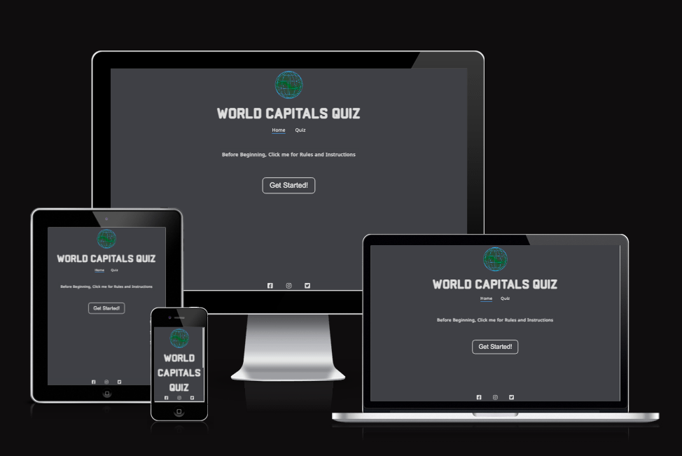

[View the live site on GitHub Pages](https://lgaudencio.github.io/geography-quiz/)

Important: To open links on this document on a new browser tab, please press CRTL + Click. 

## Site Goals

* To provide users with a fun geography game based on world capitals.
* To ensure that users can navigate the website easily and intuitively, without having to work out where to go.
* To provide users with different difficulty levels.
* To provide users with a score at the end of the quiz.
* To ensure the website is full accessible on desktops, tablets and phones.
* To ensure the game is fully compliant with screen readers. 

## User Stories 

User Story:

*As a user, I like geography games*

Acceptance Criteria: 

* It should be made clear that the website is a geography game. 

Implementation: 

* The quiz is based on a selection of capitals from around the world. The heading of this website is ‘World Capitals Quiz’ and the logo is a minimalistic design of Earth. 

User Story:

*As a user, I want to select the difficulty of the game*

Acceptance Criteria: 

* The user should have a choice of difficulty modes, to select a difficulty mode based on their knowledge level or choose to challenge themselves. 

Implementation: 

* The user will have the ability to select the difficulty mode of the game, giving them four different choices: easy, medium, hard and extreme! This will enable to user to make the game easier or more challenging. 

User Story:

*As a user, I want to know if my answer is correct or incorrect*

Acceptance Criteria: 

* The user should know if their answer choice is correct or incorrect as soon as they have clicked on their selected answer.

Implementation: 

* The user will know if their answer is correct or incorrect. The quiz answer button will highlight green if the selection is correct. If the user selects the wrong answer, their selected answer button will highlight red and the correct answer will highlight in green.

User Story: 

*As a user, I want to know my score at the end of the quiz*

Acceptance Criteria: 

* The user should be able to see their total score at the end of the quiz, both their correct and incorrect choices.

Implementation: 

* The user will be displayed with their total score as soon as they’ve answered at 20 questions. It will specifically state how many they got right and how many they got wrong.

User Story:

*As a user, I want to have choice to either restart the same quiz or choose another difficulty*

Acceptance Criteria: 

* he user should be able to restart the quiz or have a choice to change difficulty modes once they have finished the quiz.

Implementation: 

* Once the user completes the quiz, they will be presented with two buttons, one that will restart the quiz on the same difficulty mode, the other button will navigate them to the home page where they can select a different difficulty to play on.

User Story:

*As a user, I want to have clear instructions on how to play a game*

Acceptance Criteria:

* The user should have clear rules and instructions on how to play the game, that way they are not left wondering around the game.

Implementation: 

* On the landing page, there will be a button that the user can click on. This will open up a modal where the user will be presented with an ordered list of rules and instructions. This modal can be closed in two ways, either by the ‘Ok’ button or by clicking the ‘X’ on the top right and side of the modal container. Once understood, a ‘Get Started!’ button is on the landing page ready for the user to click and start the game.

User Story: 

*As a user, I want to be able to use a screen reader so it can help me play the game*

Acceptance Criteria:

* The user should not have to solely rely on vision for the website to be accessible.

Implementation:

* All none text elements that need to be understood by the user will have associated aria-labels, thus providing information to screen reader users.

## Features

### Site Wide

* Navigation Menu: 
    * The navigation menu contains links to Home and Quiz pages and it is responsive on all devices. 
    * This will allow the user to easily navigate between these pages on a device of any size. 

* Footer: 
    * The footer will contain the social media links to Instagram, Facebook and Twitter. 
    * This will allow the user to follow us and the above platforms to see when we release more quizzes for them to attempt. 

* Favicon: 
    * A favicon is added to every page, this favicon image is the same as our logo.  
    * By using a favicon, it will allow the user to easily identify the website in case they have multiple tabs opened. 

* 404 Page: 
    * A 404 error page is implemented, just in case the user happens to navigate to a broken link. 
    * If the user lands on this page, they will easily be navigated back to the hame page by their clicking on the link given, or by clicking the header. There will be no need to use the back button on the browser. 

### Home Page

* Rules and Instructions Modal

    * The home page will have a button that user will be encouraged to click on for the rules and instructions in relation to the quiz. When this button is clicked, a modal will be displayed. 
    * This was implemented so that the user can have a clear understanding of how to play the game. 

    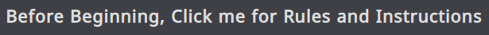

    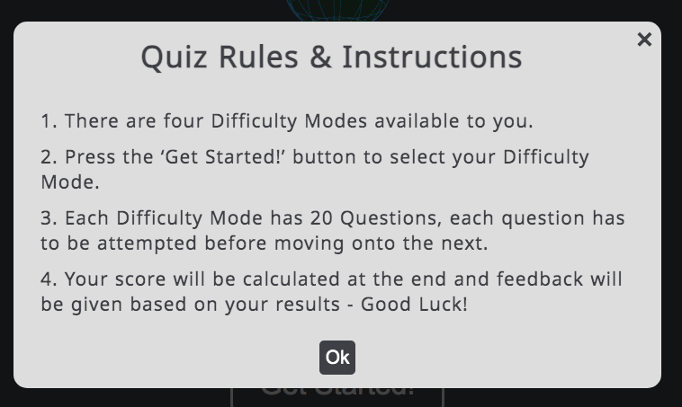

* Game Start Button 

    * A button labelled ‘Get Started!’ will direct the user to select a difficulty mode.
    * This will allow the user to select their desired difficulty mode and start the game. 

    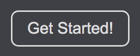

### Game Page

* Difficulty Mode 

    * The page will have four difficulty modes to choose from, the difficulties are: Easy, Medium, Hard and Extreme!
    * This will allow the user to select a difficulty mode depending on their knowledge level and even go for a harder mode is they are feeling confident.

    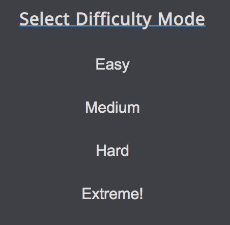

* Quiz

    * Once a difficulty mode is selected, a 20 question quiz will be displayed and each question will have 4 possible options. 
    * The user will be presented with a multiple choice quiz, only one is the correct answer and the user must select an answer before proceeding. If they don’t, the ‘Next’ button will not be displayed and the quiz cannot move forward. 

    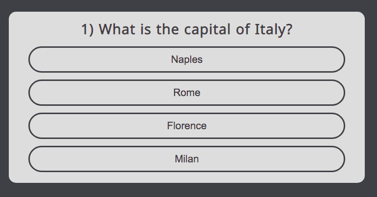

* Answering the Question 

    * In each of the 20 questions throughout the difficulty levels, the user will only have one attempt at each question. 
    * If the user selects the correct answer, the button will turn green and the ‘Next’ button will be displayed to advance to the next question. 
    * If the user selects the wrong answer, the button will turn red and the correct answer will revel itself but turning green. 

    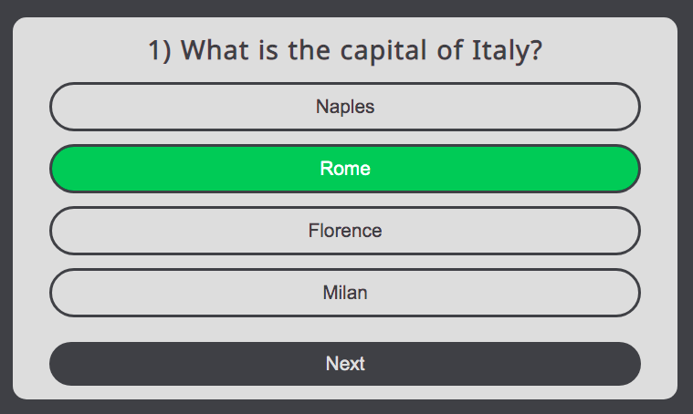

    * Once a selection has been made, the user will not be able to change it, and the cursor will be blocked when hovering over the answer buttons. 

    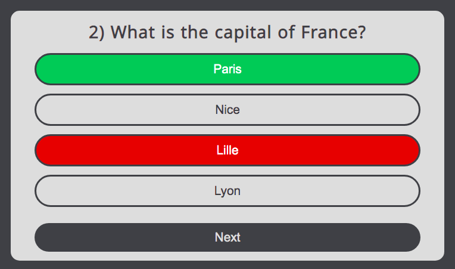

* User Feedback 

    * When the user has finished answering all 20 questions, the score will be displayed. It will state to the user how many they got correct and how many they got incorrect. 
    * Based on the users score, a small feedback sentence will be returned. This should be able to encourage the user to try again on the same difficulty to beat their current score or to try a harder level. 

    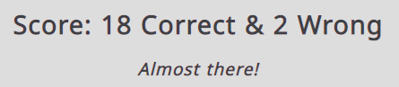

* End of Quiz

    * Along with the feedback, the user will have the opportunity to either restart that same quiz or they will have the option to go back to the homepage and select a different difficulty mode. 
    * The user will have two controls to choose from ‘Restart’ or ‘Home’.  

    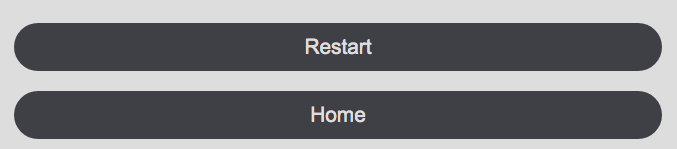

### Features Left to Implement 

* A time limit for each question. 
* Sound effects for correct and incorrect answers. 

## Technologies 

* HTML
    * HTML was used as the main language to develop the structure of the website.

* CSS
    * Custom CSS was used to style the website and it exists in an external file.

* JavaScript 
    * JavaScript was used for the multiple choice quiz gameplay and it exists in an external file. 

* GitHub
    * GitHub IDE was used the develop the website.
    * GitHub is used to host the source code and it is deployed using Git Pages.

* Git 
    * Git is used to commit and push code during the development of the website.

* Font Awesome 
    * Icons used in this website can be found on the [Font Awesome Website](https://fontawesome.com/). Icons used were for the social media links, which can be found on the footer of the website. 

* Favicon 
    * The favicon used was created on the [favicon.io Website](https://favicon.io/).

* Canva
    * Canva was used to create the logo in the header, also, that same image was used to create the favicon. 

* Uizard
    * Uizard was used to create the wireframes for this project. 

## Wireframes 

* Home Page for Desktop

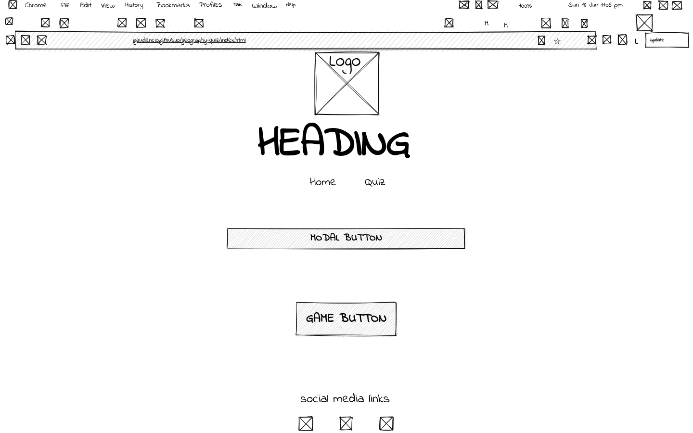

* Home Page for Mobile 

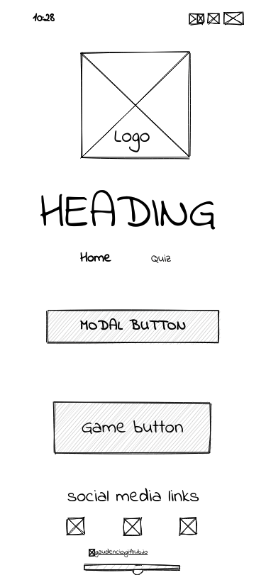

* Game Page (Select Difficulty Mode) for Desktop

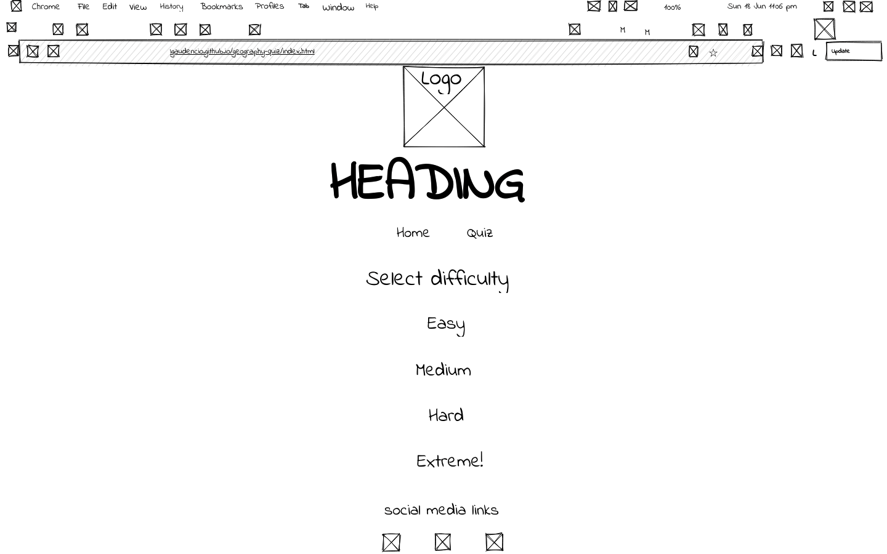

* Game Page (Select Difficulty Mode) for Mobile 

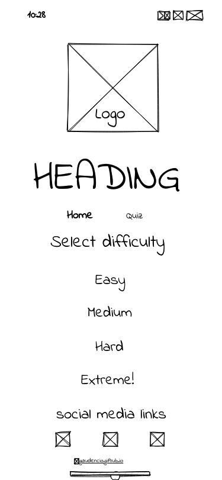

* Quiz for Desktop 

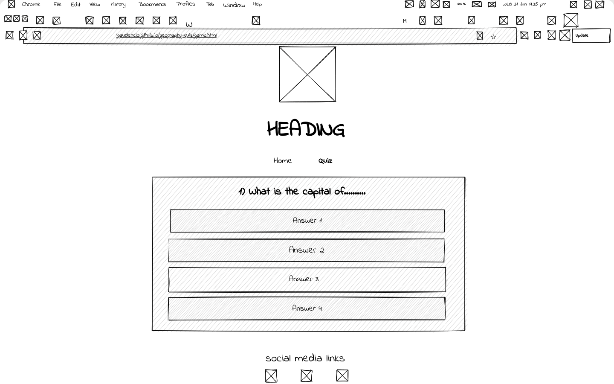

* Quiz for Mobile

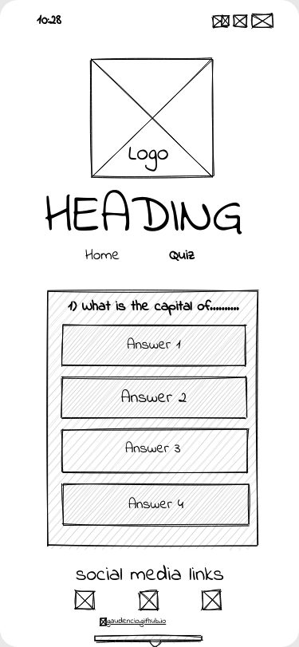

## Design 

* Typography 

Google fonts was used to find a font that would be clean and clear for all users. As the website is for a quiz, a font that is easy to read was a high priority. Two fonts were chosen for the website, Monomaniac One was the font to be used for the main heading (H1) of the website. Noto Sans Chorasmian was the font to be used for all the other text on the website.

* Colour Scheme 

To ensure that the colours used for the different elements would have a good contract, a website called [Coolors](https://coolors.co/) was used to generate a palette of colours to use.

The main colours used on the website are:

* #3F4045 - Dark Grey
* #dddddd - Light Grey
* #56aeff - Blue

Other colours were used on the quiz part of the site, these colours were:

* #20bf55 - Green (used for correct answer selection)
* #d62828 - Red (used for incorrect answer selection)
* #ffffff - White (text colour will change to white when the button hightlight green or red)

* Layout 

The content of the website has been centred with no distractions on the sides. It was designed to have a minimalistic look as also seen from the logo. This design was to enure that users would not get distracted, having it centred also gives it an easy flow approach and makes it easy to navigate around.

## Testing

### Responsiveness 

During the styling phase for media queries, all pages were tested to ensure responsiveness on screen sizes from 280px and upwards. All pages were tested on Chrome, Safari and Edge browsers.

Steps to test:

1. Open a browser and go to WEBSITE
2. Right click on the page and select 'Inspect', this will open up developer tools.
3. Decrease the screen size to 280px.
4. Click and drag the responsive window to set the width for testing.

Expected:

Website is to be responsive on all screen sizes and no images/logos are to be pixelated or distorted due to stretching. No horizontal scroll appears on mobile devices and nothing overlaps.

Actual:

Website behaved as expected. 

The website was tested for its responsiveness on the following devices and no issues were observed:

* Samsung Galaxy Fold
* iPad Air
* Surface Pro 7
* Nexus 10

### Functional Testing

#### Navigation Links

Testing was conducted on the navigation links on all pages to ensure that the corresponding page opens. This was accomplished by clicking on each of the navigation links on each page. Navigation Link (Page Opened):

* Home (index.html)
* Quiz (game.html)

Links on all pages navigated to the correct pages as expected.

#### Footer Social Media Icons/Links

Testing was performed on the Font Awesome Social Media icons to ensure that when the link is clicked, the corresponding page opens in a new tab.

Each item opened in a new tab as expected when clicked. 

#### Modal 

Testing was performed on the modal to ensure that when it is clicked the modal will display the Rules & Instructions of the quiz. The modal opened as expected and displayed the correct information. 

Testing was also performed on the ‘X’ located on the top right of the modal and the ‘Ok’ button located at the footer of the modal. It is expected that when the user clicks on either of them, the modal shall close. Testing was conducted separately, for obvious reasons, but both elements behaved as expected, they both successfully closed the modal. 

#### Play Game (’Get Started!’) Button 

Testing was performed on the ‘Get Started!’ button to ensure that when the user clicks it, it takes them to the page where they can select the difficulty mode they wish to play on. Testing was performed by clicking on the button. The button functions as expected, by taking the user to select their preferred difficulty mode. 

#### Quiz - Answer Buttons 

Testing was performed on the answer buttons that are displayed with the four possible answers. It is expected that when the user clicks on the correct answer, the background colour of the button changes to green and then the user selects the incorrect answer, the background colour will change to red and the correct answer will reveal itself by the background colour changing to green. Once the user makes their selection, the four answer option buttons will be disabled so the user cannot change their answer. 

The buttons behaved as expected, when the correct answer was selected, the background colour changed to green. If the wrong option was selected, the button turned red and the correct answer button changed to green. Once selection was made, the buttons became inactive and it was not possible to change the answer. 

#### Quiz - Control Buttons

Next Button:

* Testing was performed the the ‘Next’ button by going through each quiz difficulty. Once the user clicks on their selected answer button, the ‘Next’ button should appear so the user can proceed to the next question. The ‘Next’ button performed as expected. 

Restart & Home Buttons: 

* Testing was performed on both these buttons by completing a quiz in each difficulty mode, once completed, both these buttons should appear to the user. The ‘Restart’ button will restart the quiz from the difficulty mode that the user first selected and the questions will be in a random order. If the ‘Home’ button is clicked by the user, it will navigate them back to the Homepage (index.html) and the user can select a different difficulty mode. Both these buttons performed as expected. 

## Deployment 

### Version Control

GitHubs IDE was used to create this website, it was then pushed to the remote repository ‘geography-quiz’.

Git commands were used during the development to push code to the remote repo, the following commands were the following:

* *git add <file>* - This command is used to add a file to the staging area.
* *git commit -m "text"* - This git command is used to commit changes made to the code and sent to the local repository.
* *git push* - This git command is used then the committed code was pushed to the remote repository on GitHub.

### Deployment to GitHub Pages

* The website was deployed to GitHub pages, the steps to do this are the following:

    * On the GitHub repository page, click on Settings.
    * On the left menu, click on Pages.
    * On the source section drop down menu, click on Main.
    * Click Save.
    * If done correctly, a link to the live website will be given on a banner.

### Clone the Repository Code Locally

To clone the Github repository to use locally, the following will have to be done:

* Click on the green Code button, which has a drop down menu 
* Click on HTTPS
* Copy the repository link that's on the clipboard 
* Open an IDE of your choice (note: git must be installed for the next steps)
* Type git clone copied-git-url into the terminal of the IDE

Once these steps are followed, the project will be cloned on your local machine ready for use.